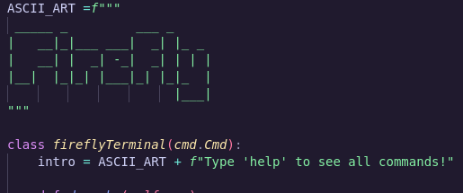

# 🔥 Firefly Terminal

A fun, lightweight, command-line terminal built with Python — packed with utility functions, simple games, ASCII art, and a retro vibe. It brings together essential file operations, system commands, and a sprinkle of humor.
Built for the Summer-of-Making competition



---

## 🚀 Features

### Basic
- `clear` — Clear screen.
- `exit` — Exit the terminal.
- `about` — Info about the terminal.

### 🧰 Core Utilities
- `echo [text]` — Echo input text back.
- `time` — Display current system time.
- `cd [path]` — Change working directory.
- `ls` — List files and folders.
- `pwd` — Show current directory.
- `ping [host]` — Ping a website or IP.
- `stat [file/dir]` — Show file/directory info.
- `open [file]` — Open a file using the default system app.

### 📁 File Management
- `fly [filename]` — Create a new file.
- `cat [filename]` — View contents of a file.
- `append [filename]` — Append lines to a file (ends with `:wq`).
- `overwrite [filename]` — Overwrite file content line-by-line.
- `rename [old] [new]` — Rename files.
- `rm [filename]` — Delete a file.
- `mkdir [name]` — Create a directory.
- `rmdir [name]` — Remove a directory.
- `find [filename]` — Search for a file in the current directory tree.

### 🧮 Math & Python
- `calc [expression]` — Lightweight calculator (`+`, `-`, `*`, `/`).
- `py [code]` — Execute inline Python expressions/statements.

### 🎮 Games
- `flip` — Flip a coin.
- `roll [sides]` — Roll a dice (2 to 20 sides).
- `rps` — Rock, Paper, Scissors.
- `race` — Race-to-a-number turn-based game.
- `games` — List all available games.

### 🎨 Easter eggs
- `luffy` — Luffy ASCII art!
- `strawhats` — STRAWHATS!

---

## 🖥️ Preview

```shell
 _____ _         ___ _
|   __|_|___ ___|  _| |_ _
|   __| |  _| -_|  _| | | |
|__|  |_|_| |___|_| |_|_  |
                      |___|
Type 'help' to see all commands!

```

## 🧑‍💻 Installation
Prerequisites:

    Python 3.6+

Run the terminal:

python3 firefly_terminal.py

## ✨ Notes

    Fully cross-platform (Windows, macOS, Linux).

    Most file operations are wrapped in safe exception handling.

    Includes built-in text editor (append & overwrite with :wq save).

    This is a playful sandbox project — not intended for production shell replacements.

<sup> Built with ❤️ by solar <sup>
